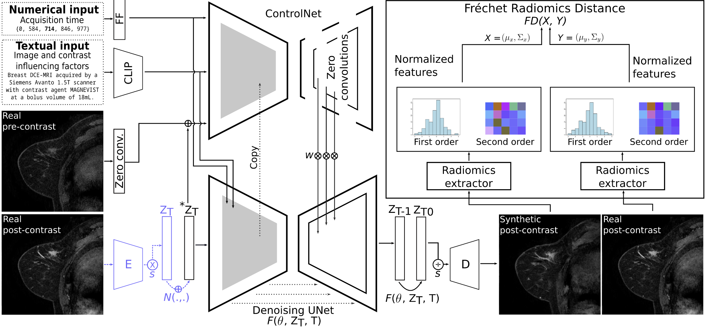

# CCnet
ContrastControlNet: Official repository of "Towards Learning Contrast Kinetics with Multi-Condition Latent Diffusion Models"

The codebase is currently being compiled and will be made readily available soon. In urgent cases please contact richard[dot]osuala[at]ub[dot]edu.

